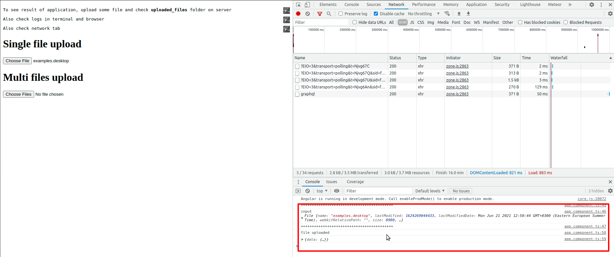

# What is it?

This is solution to upload files using:
- `@apollo/client`: `^3.0.0`,
- `@nguniversal/express-engine`: `^12.1.0`,
- `apollo-angular`: `^2.6.0`,
- `apollo-server-express`: `^2`,
- `express`: `^4.15.2`,
- `graphql`: `^15.5.1`,
- `graphql-upload`: `^12.0.0`,

### How it looks and works.

### Why `apollo-server-express: ^2` ?

When use version 3, next errors occurs
> UnhandledPromiseRejectionWarning: Error: You must await server.start() before calling server.applyMiddleware() at ApolloServer

This is a known bug with an open issue, and a merged PR to fix it. For now, you can downgrade to apollo-server-express@^2
https://stackoverflow.com/a/68354663/3156757

Also, this warning not resolved in console, this warning becomes with version `^2`:
> ./node_modules/subscriptions-transport-ws/node_modules/ws/lib/buffer-util.js:105:21-42 - Warning: Module not found: Error: Can't resolve 'bufferutil' in '/media/gyerts/home/Projects/solutions/angular-ssr-graphql-apollo-express-upload-file/node_modules/subscriptions-transport-ws/node_modules/ws/lib'
